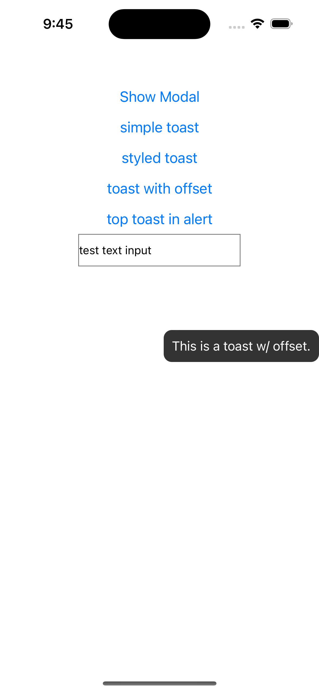
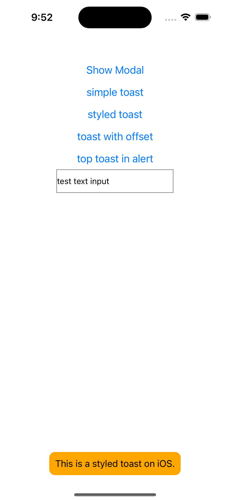
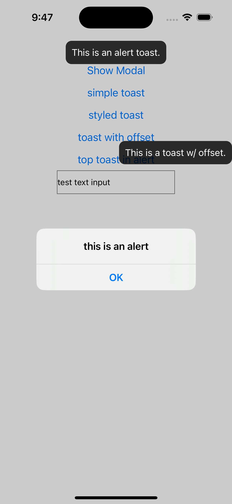
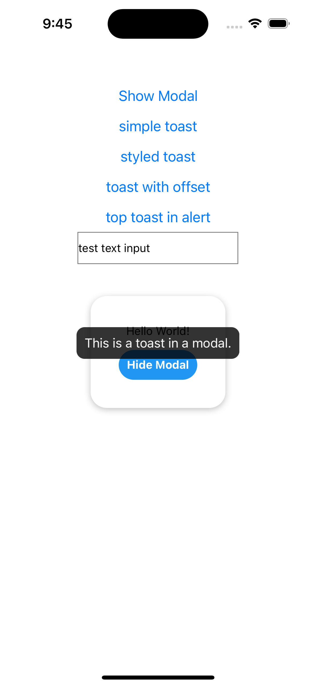
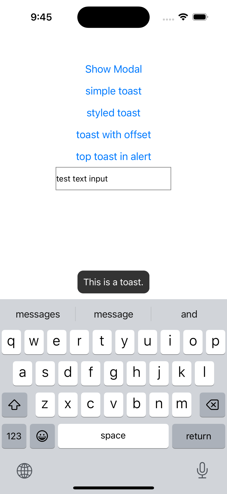
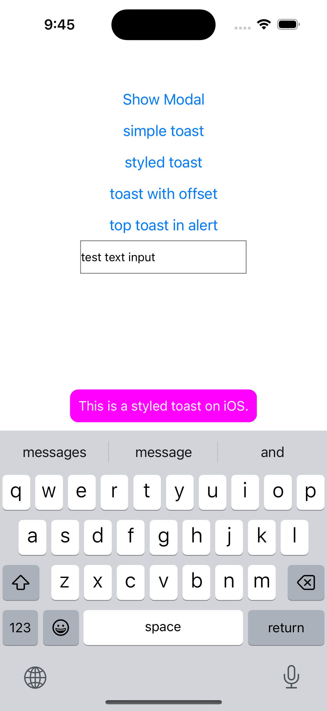

# react-native-simple-toast [](https://badge.fury.io/js/react-native-simple-toast)

React Native Toast component for both Android and iOS. It just lets iOS users have the same toast experience as on Android. Using [scalessec/Toast](https://github.com/scalessec/Toast) on iOS and the React Native's [ToastAndroid](http://facebook.github.io/react-native/docs/toastandroid.html) on Android.

## Summary

✅ supports both old and new architecture (RN >= 0.71 is required for new arch)

✅ extremely simple fire-and-forget api, same as `ToastAndroid`

✅ renders on top of `Modal`s and `Alert`s

✅ customizable styling

## Screenshots

<table>
  <tr>
    <td><p align="center"></p></td>
    <td><p align="center"></p></td>
  </tr>

</table>

<details>
  <summary>Expand for more screenshots</summary>

<table>
  <tr>
    <td><p align="center"></p></td>
    <td><p align="center"></p></td>
  </tr>
  <tr>
    <td><p align="center"></p></td>
    <td><p align="center"></p></td>
  </tr>
</table>

</details>

## Install

```bash
yarn add react-native-simple-toast
cd ios && pod install
```

then rebuild your project

## Usage

the module exposes the following functions, same as `ToastAndroid`, with extra configuration parameter for iOS only:

```ts
import Toast from 'react-native-simple-toast';

Toast.show(message, duration, options);

Toast.showWithGravity(message, duration, gravity, options);

Toast.showWithGravityAndOffset(
  message,
  duration,
  gravity,
  xOffset,
  yOffset,
  options,
);
```

exported duration and positioning constants:

```ts
import Toast from 'react-native-simple-toast';

Toast.LONG;
Toast.SHORT;
Toast.TOP;
Toast.BOTTOM;
Toast.CENTER;
```

Please note that `yOffset` and `xOffset` are [ignored on Android 11 and above](<https://developer.android.com/reference/android/widget/Toast#setGravity(int,%20int,%20int)>).

For customizing on iOS, you can pass an object with the following properties:

```ts
type OptionsIOS = {
  textColor?: ColorValue;
  backgroundColor?: ColorValue;
  tapToDismissEnabled?: boolean;
};
```

## Examples

```js
import Toast from 'react-native-simple-toast';

Toast.show('This is a short toast');

Toast.show('This is a long toast.', Toast.LONG);

Toast.showWithGravity(
  'This is a long toast at the top.',
  Toast.LONG,
  Toast.TOP,
);

Toast.show('This is a styled toast on iOS.', Toast.LONG, {
  backgroundColor: 'blue',
});

Toast.show('This is a toast that can be dismissed (iOS only).', Toast.LONG, {
  tapToDismissEnabled: true,
});
```

## License

MIT

---

Made with [create-react-native-library](https://github.com/callstack/react-native-builder-bob)
